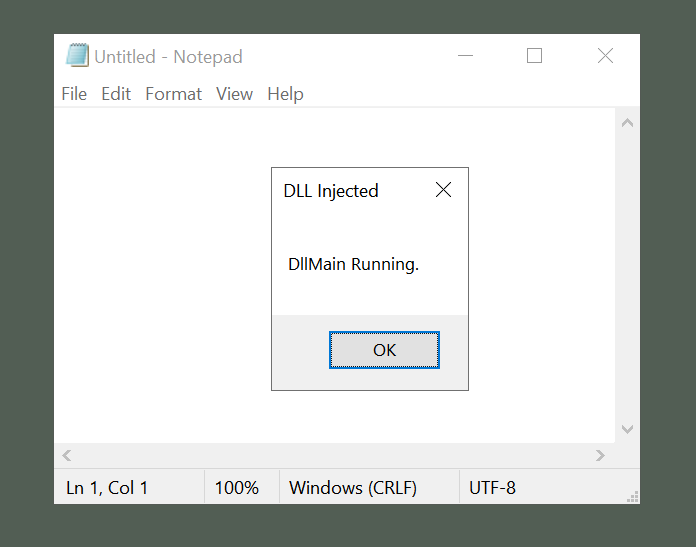

# Basic DLL Injection

A simple POC for DLL Injection by writing the full path into memory
and calling `CreateRemoteThread()`.

Written in C++ for Windows 10.



## Usage

```
DLLInject.exe <Process-Id> <DLLFileName>
```